# mem_profile: an Ownership-Aware Memory Profiler

mem_profile is an ownership-aware memory profiler, designed for direct
measurement of objects and their members.

What does this mean?

When a program is executed with mem_profile, we can see the number of bytes
allocated by types within the program.

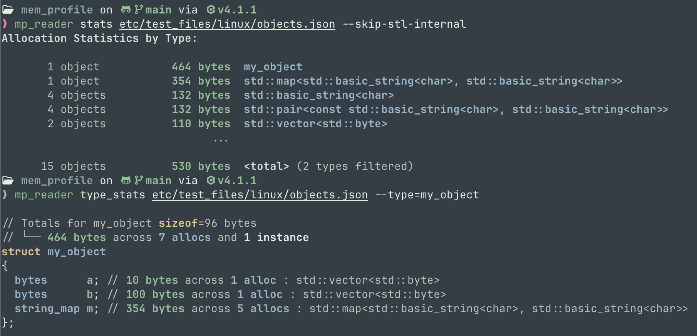

Above is some sample output, produced by the analyzer. This output comes from a
profile of [`examples/src/objects.cpp`](examples/src/objects.cpp).

This is a toy example, but mem_profile is designed for use with complex
workloads, and has been tested on projects involving hundreds or even thousands
of translation units.

For instance, here's an output of type-level stats from profiling an FTXUI demo
application:

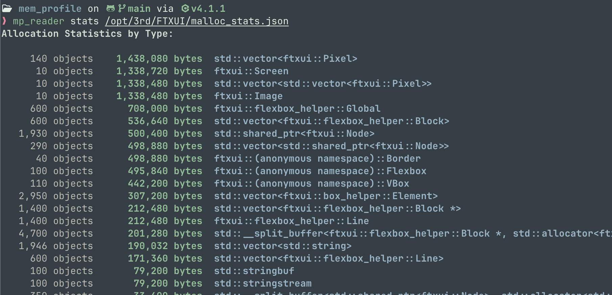

And here's output from profiling CMake:

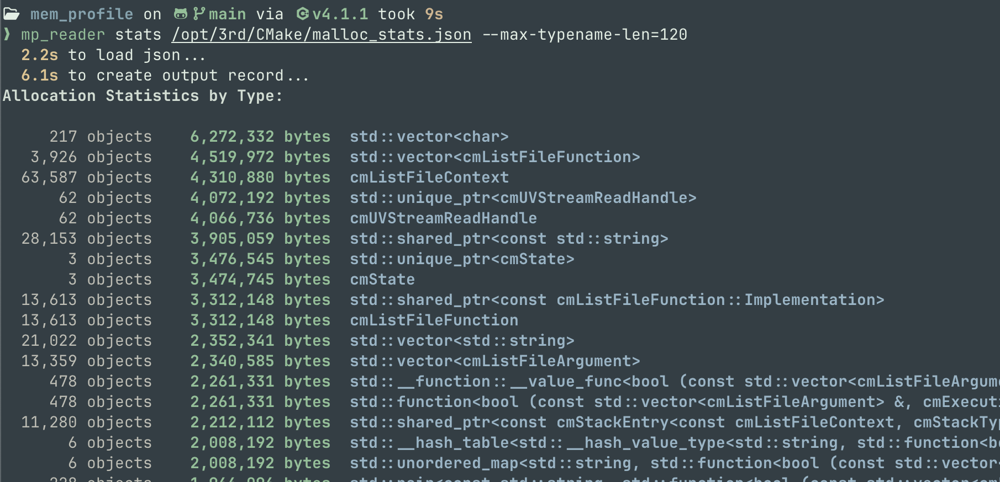

## How does this work?

`mem_profile` has three components:

1. A compiler plugin for Clang, which embeds type information in the binary and
   annotates destructor calls.
2. The profiler runtime, which tracks allocations and deallocations, and stores
   the output to a data file.
3. An analyzer, which allows querying the resulting datafile for type
   information.

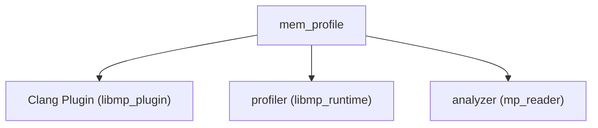

The output data file is named `malloc_stats.json`, however this can be
configured with the `MEM_PROFILE_OUT` environment variable:

```
env MEM_PROFILE_OUT=my_stats.json ...
```

## Building and Installing mem_profile

mem_profile can be built with `cmake`:

```sh
cmake -B build -G Ninja -DCMAKE_BUILD_TYPE=Release
cmake --build build
cmake --install build --prefix ./install
```

If the build process complains that it cannot find clang, you may need to
provide a path to clang via `CMAKE_INSTALL_PREFIX`:

```sh
cmake -B build -G Ninja -DCMAKE_BUILD_TYPE=Release -DCMAKE_INSTALL_PREFIX=/path/to/clang
cmake --build build
cmake --install build --prefix ./install
```

In this example, I just installed it in a folder `./install` in the current
directory, however you may install it at whatever location is convenient (eg,
`/usr/local`).

[`mp_reader`](https://github.com/codeinred/mp_reader) is currently implemented
in python, and it can be installed with either `pip` or `pipx`.

If available, I recommend `pipx`, which will install it as a standalone
executable that you can run, independent of existing python environments.

```sh
pipx install mp_reader
```

## Running the profiler manually

The simplest way to get started is to build and run an example manually. There
is a quick and easy way to do this process automatically from CMake, however for
users wishing to build from something _other_ than CMake, it's good to
understand the process.

These steps are:

1. Build your program with the plugin. To do this, you need to add two flags to
   your build: `-fplugin=/path/to/plugin`, and
   `--include=/path/to/mp_hook_prelude.h`.
2. Execute our program using `LD_PRELOAD` to load the runtime
3. Use `mp_reader` to query the resulting data file

```sh
clang++ -fplugin=install/lib/libmp_plugin.so    \
    --include=install/include/mp_hook_prelude.h \
    -Og examples/src/objects.cpp -o objects
env LD_PRELOAD=install/lib/libmp_runtime.so ./objects
mp_reader stats malloc_stats.json
```

On macos, you will need to change `.so` to `.dylib`, and `LD_PRELOAD` will
become `DYLD_INSERT_LIBRARIES`:

```sh
/opt/homebrew/opt/llvm/bin/clang++ \
    -fplugin=install/lib/libmp_plugin.dylib \
    --include=install/include/mp_hook_prelude.h \
    -Og examples/src/objects.cpp -o objects
env DYLD_INSERT_LIBRARIES=install/lib/libmp_runtime.dylib ./objects
mp_reader stats malloc_stats.json
```

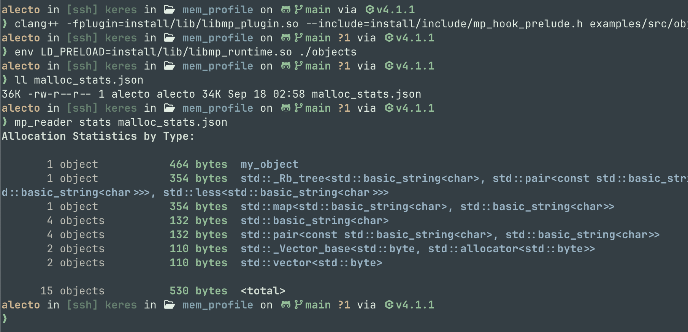

### Note on Optimization

Because of the annotations inserted by the compiler plugin, you _can_ build with
compiler optimizations enabled.

If you care about getting stack traces, I recommend `-Og`, however, the profiler
will work even at `-O3`.

## Building with CMake

Once you've installed `mem_profile`, you will be able to use `mem_profile` from
CMake. This simplifies the process of building with the plugin, and enables use
of `mem_profile` in complex projects.

Add these lines to your CMake:

```cmake
# If you do this, I recommend putting it behind a flag
# (unless doing it as a one-off)
if(BUILD_WITH_MEM_PROFILE)
   find_package(mem_profile REQUIRED)
   link_libraries(mp::mp_build_with_plugin)
endif()
```

Running the profiler remains the same:

```sh
# linux
env LD_PRELOAD=/usr/local/lib/libmp_runtime.so /path/to/your/application

# macos
env DYLD_INSERT_LIBRARIES=/usr/local/lib/libmp_runtime.dylib /path/to/your/application
```

As before, the profiler will output `malloc_stats.json`, which you can analyze
with `mp_reader`.

Because the compiler plugin is written for LLVM clang, ensure that you are
building with clang.

### Building via `CMAKE_CXX_FLAGS`

It is also possible to build using the plugin, _without_ modifying the
CMakeLists.txt. To do this, add the compiler flags discussed in "Running The
Profiler Manually". For example, if you've installed the plugin to
`/usr/local/lib`, you can do this with

```sh
-DCMAKE_CXX_FLAGS="-fplugin=/usr/local/lib/libmp_plugin.so --include=/usr/local/include/mp_hook_prelude.h -Og"
```

(Or `.dylib` for macos).

Ensure that you are building with clang.

# Neat Examples

## Examples - lambda memory usage

mem_profile can measure the memory usage of a lambda. Because lambdas have no
named fields, all fields are unnamed.

```cpp
using bytes   = std::vector<std::byte>;
using floats  = std::vector<float>;
using doubles = std::vector<double>;

int main() {
    auto myLambda = [a = bytes(10),   //
                     b = floats(100), //
                     c = doubles(1000)]() {};
}
```

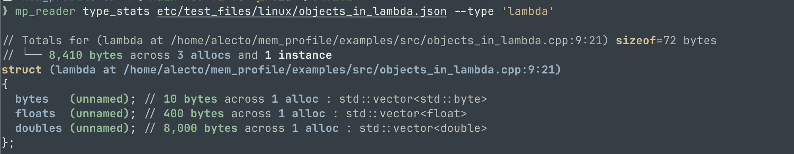

## Examples - members in c-style array

mem_profile can tell you how much memory is allocated over the lifetime of a
program by each member of a c-style array, in a parent type:

```cpp
using bytes = std::vector<std::byte>;

struct array3 {
    bytes elems[3];
};

int main() {
    array3 values{
        bytes(10),
        bytes(100),
        bytes(1000),
    };
}
```

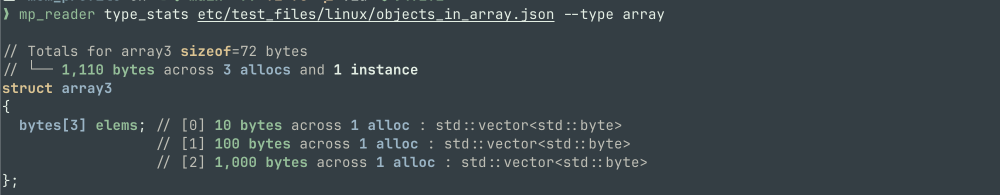

## Examples - [beman project - inplace vector](https://github.com/bemanproject/inplace_vector)

mem_profile can measure allocations in members allocated inside an
`inplace_vector` (arriving in C++26):

```cpp
using bytes = std::vector<std::byte>;

int main() {
    beman::inplace_vector<bytes, 100> v;
    v.push_back(bytes(10));
    v.push_back(bytes(20));
    v.push_back(bytes());
    v.push_back(bytes(100));
}
```

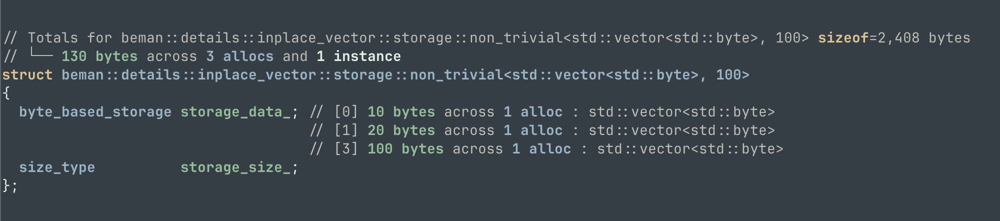

As `v[2]` didn't own any memory, it is omitted during output by `mp_reader`.

## Examples - CMake

Breakdown by member for `cmState`, which holds a significant portion of the
state for a running instance of CMake. This profile was taken when running the
configuration step.

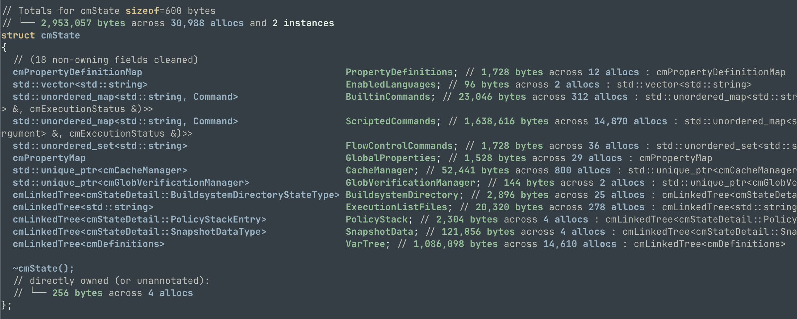

## Examples - [FTXUI](https://github.com/ArthurSonzogni/FTXUI)

When profiling `ftxui_example_html_like`, we can see that `ftxui::Screen`
inherits from `ftxui::Image`, and almost off of the memory it owns belongs to
`ftxui::Image`:

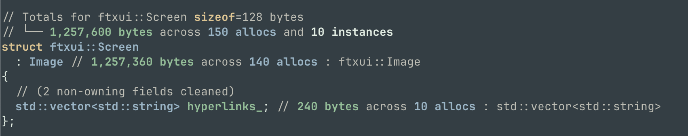

All the instances of `ftxui::Node` are instances of `ftxui::Border`, which
inherits from `Node`:

```cpp
// For reference, here is the charset for normal border:
class Border : public Node {
 public:
  Border(Elements children,
         BorderStyle style,
         std::optional<Color> foreground_color = std::nullopt)
    // ...
};
```

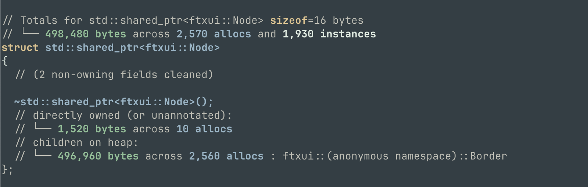

Most of the memory of `ftxui::flexbox_helper::Global` is taken up by it's
blocks:

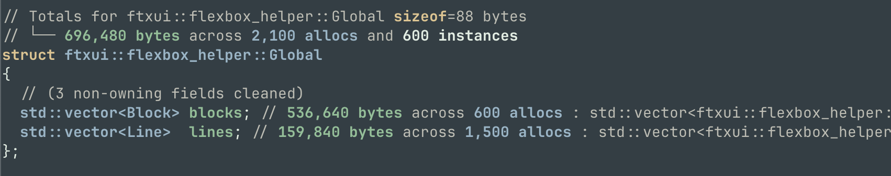

# Troubleshooting

It is my hope that one day, running `mem_profile` will be quick, easy, and
painless, although at the current moment this project is young, and may contain
sharp edges.

This section will describe common issues encountered when running the profiler;
the potential causes; and how to diagnose and fix these issues.

## Missing `malloc_stats.json` file

If no `malloc_stats.json` appears after running your program with the plugin,
ensure that the program exited gracefully.

If you use Ctrl+C to kill a program (or your program segfaults, or
`std::terminate` is called), no cleanup will occur and mem_profile will not have
the opportunity to generate `malloc_stats.json`.

## `malloc_stats.json` exists, but all allocations are untyped

You may sometimes get a `malloc_stats.json` with no type information (only
stacktraces).

```
Allocation Statistics by Type:

    9,614 allocs    3,072,024 bytes  <untyped>

       0 objects    3,860,984 bytes  <total>
```

If this occurs, there are a couple causes:

1. You ran the profiler on a program that wasn't built with the plugin. (eg, if
   you run the profiler on a prebuilt program, there are no type annotations)
2. **[MacOS only]** You built with AppleClang, instead of LLVM clang.
   UNFORTUNATELY, AppleClang will silently ignore the plugin.

   If this occurs, clear the build directory, and build again with LLVM Clang:

   ```
   env CC=/opt/homebrew/opt/llvm/bin/clang CXX=/opt/homebrew/opt/llvm/bin/clang++ cmake -B build -G Ninja ...
   ```

3. **[MacOS/ARM platforms]** You built with no optimization.

   The compiler plugin works by injecting annotations / type information at the
   beginning of the destructor stack frame. However, with `-O0`, the stack
   sometimes becomes so polluted that the profiler cannot find destructor
   annotations at runtime. (For performance reasons, it only searches the first
   couple entries in the stackframe for large frames, rather than scanning the
   entire frame).

   I have only observed this issue on MacOS, but it's possible that it also
   exists on ARM linux.

   I recommend enabling at least `-O1` or `-Og` in order to fix it.

In any case, ensure that you are using clang, and that you are building with the
mem_profile compiler plugin.

## How to check that you're building with the plugin

If you set `env MEM_PROFILE_PRINT_BODY=1` when building, the plugin will display
the body of any destructor calls which it rewrites.

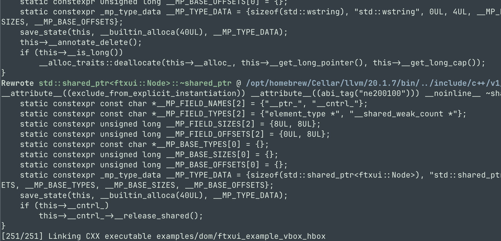

This will allow you to confirm that the plugin is running, and working as
intended.

```sh
cmake --build build --target clean
env MEM_PROFILE_PRINT_BODY=1 cmake --build build
```

This tends to be rather verbose. You can limit output to just the names of
rewritten destructors using `MEM_PROFILE_PRINT_NAME=1`:

```sh
cmake --build build --target clean
env MEM_PROFILE_PRINT_NAME=1 cmake --build build
```

## Known Issues

See [the issues page](https://github.com/codeinred/mem_profile/issues) for a
full list of issues people have filed.

Three significant issues which I am currently in the process of resolving are:

- [ ] Fix Allocation Tracking for Global variables ([#1][1])
- [ ] Annotations to Non-Inline Destructor Calls Do Not Propagate to Codegen
      Phase ([#2][2], this is a plugin issue)
- [ ] `std::string` is not instrumented properly on MacOS ([#3][3])

[1]: https://github.com/codeinred/mem_profile/issues/1
[2]: https://github.com/codeinred/mem_profile/issues/2
[3]: https://github.com/codeinred/mem_profile/issues/3
